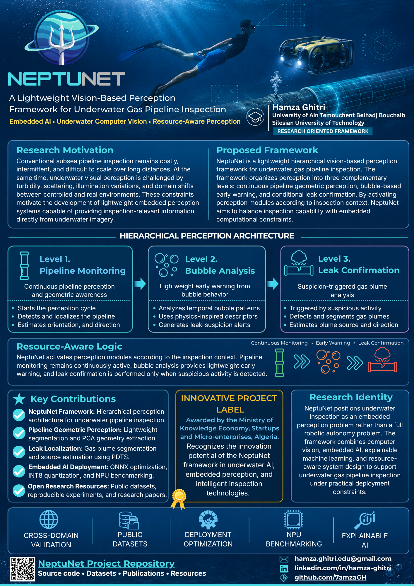
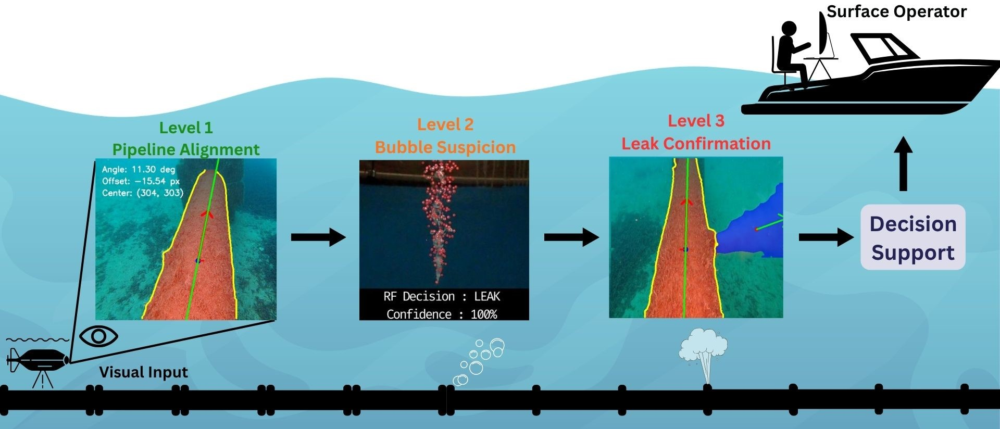
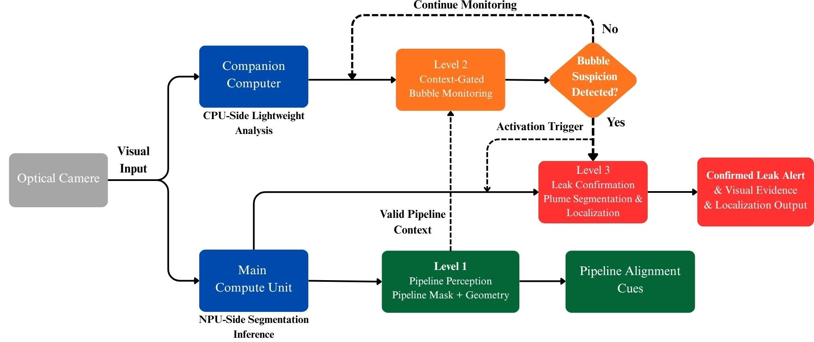
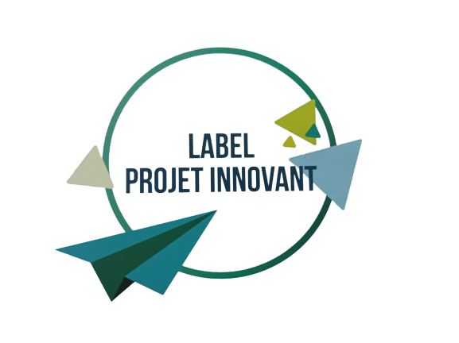

<div align="center">


# NeptuNet

### A Lightweight Vision-Based Perception Framework for Underwater Gas Pipeline Inspection

**Embedded AI • Underwater Computer Vision • Resource-Aware Perception • Explainable Leak Monitoring**

[](https://python.org)
[](https://ultralytics.com)
[](https://onnx.ai)
[](#embedded-ai-and-deployment)
[](#embedded-ai-and-deployment)
[](#level-2--bubble-based-early-warning)
[](LICENSE)

<br/>

★ [Pipeline Perception](https://github.com/7amzaGH/Underwater-Pipeline-Geometric-Perception) &nbsp;·&nbsp;
★ [Bubble Monitoring](https://github.com/7amzaGH/TUBLEX-Bubble-Plume-Analysis) &nbsp;·&nbsp;
★ [Leak Confirmation](https://github.com/7amzaGH/Underwater-Leak-Geometric-Perception) &nbsp;·&nbsp;
★ [Master Thesis](docs/NeptuNet_Master_Thesis.pdf) &nbsp;·&nbsp;
★ [Research Poster](poster/neptunet_poster.pdf)

<br/>



<br/>

**A research-oriented embedded perception framework for underwater gas pipeline inspection.**

</div>

---

## Overview

**NeptuNet** is a lightweight hierarchical vision-based perception framework for underwater gas pipeline inspection.

The framework connects three complementary perception levels:

| Level | Module | Role | Main Outputs |
|---|---|---|---|
| **Level 1** | Pipeline Geometric Perception | Continuous infrastructure awareness | Pipeline center, orientation, direction |
| **Level 2** | Bubble-Based Early Warning | Lightweight temporal leak suspicion | Suspicion score, temporal bubble descriptors, SHAP explanations |
| **Level 3** | Leak Confirmation | Conditional gas plume analysis | Plume mask, probable source, propagation direction |

NeptuNet is designed around a resource-aware perception philosophy: instead of running all inspection models continuously, perception is organized according to inspection context. Pipeline perception remains continuously active, bubble analysis provides lightweight early warning, and leak confirmation is activated when suspicious activity is detected.

This repository serves as the **central project hub** for NeptuNet. Detailed source code, datasets, models, demos, and experiments are maintained inside the corresponding module repositories.

---

## Research Motivation

Conventional subsea pipeline inspection remains costly, intermittent, and difficult to scale over long distances. Underwater visual perception is also affected by turbidity, scattering, illumination variation, low contrast, biofouling, and domain shifts between controlled and real underwater environments.

These constraints motivate embedded perception systems that can extract inspection-relevant information directly from underwater imagery while remaining lightweight enough for deployment-oriented robotic platforms.

NeptuNet addresses this challenge by combining:

- segmentation-based pipeline geometry,
- physics-inspired bubble plume monitoring,
- explainable machine learning,
- physics-guided gas plume representation,
- lightweight instance segmentation,
- ONNX and INT8 deployment workflows,
- and CPU/NPU-aware perception organization.

The project positions underwater inspection as an **embedded perception problem**, not as a complete closed-loop AUV autonomy system.

---

## Framework Architecture

<p align="center">
  
</p>

NeptuNet follows a context-suspicion-confirmation structure:

```text
Continuous Pipeline Monitoring
        ↓
Bubble-Based Suspicion
        ↓
Conditional Leak Confirmation
```

Each level answers a different inspection question:

| Question | NeptuNet Level |
|---|---|
| Where is the pipeline and how is it oriented? | Level 1 |
| Is there suspicious bubble activity near the inspection context? | Level 2 |
| Is there a visible gas plume and where is its probable source? | Level 3 |

---

## Level 1 — Pipeline Geometric Perception

Level 1 provides continuous pipeline-centered perception from monocular underwater imagery.

It estimates:

- pipeline segmentation mask,
- image-plane center offset,
- dominant pipeline orientation,
- directional alignment cue: `LEFT`, `STRAIGHT`, or `RIGHT`.

This module uses lightweight instance segmentation and PCA-based geometric extraction to transform segmentation masks into navigation-relevant geometric cues.

<p align="center">
  
</p>

### Core Methods

- YOLOv8n-seg instance segmentation
- ONNX deployment-oriented inference
- prototype-mask reconstruction
- bounding-box-guided mask cropping
- PCA-based center and orientation estimation
- INT8 NPU benchmarking

### Repository

[Underwater-Pipeline-Geometric-Perception](https://github.com/7amzaGH/Underwater-Pipeline-Geometric-Perception)

Datasets, model details, evaluation scripts, inference demos, and benchmark tables are provided inside the module repository.

---

## Level 2 — Bubble-Based Early Warning

Level 2 analyzes temporal bubble plume behavior to identify leak-suspicious activity.

Instead of relying only on frame-level detection, this module encodes short-term bubble dynamics into physics-inspired descriptors. These descriptors capture density, temporal stability, vertical structure, and short-term persistence. A tree-based classifier then produces interpretable leak-suspicion predictions.

<p align="center">
  
</p>

### Core Methods

- adaptive underwater preprocessing
- bubble candidate detection
- spatial filtering
- temporal windowing
- physics-inspired feature extraction
- Random Forest and XGBoost comparison
- SHAP-based explainability

### Main Outputs

- bubble activity descriptor vector,
- leak-suspicion score,
- interpretable feature attributions,
- lightweight early-warning signal.

### Repository

[TUBLEX-Bubble-Plume-Analysis](https://github.com/7amzaGH/TUBLEX-Bubble-Plume-Analysis)

Datasets, windowing scripts, feature extraction code, trained classifiers, SHAP analysis, and evaluation details are provided inside the module repository.

---

## Level 3 — Leak Confirmation

Level 3 performs conditional gas plume segmentation and geometric leak characterization.

This module uses **Physics-Guided Diffuse-Texture Separation (PDTS)** to enhance diffuse plume structures while suppressing high-frequency underwater background texture. The resulting representation is processed using a lightweight segmentation model, and the predicted mask is converted into geometric leak descriptors.

<p align="center">
  
</p>

### Core Methods

- Physics-Guided Diffuse-Texture Separation
- YOLOv8n-seg plume segmentation
- ONNX deployment-oriented mask reconstruction
- INT8 quantization
- plume centroid estimation
- probable image-plane source localization
- plume direction estimation

### Main Outputs

- gas plume segmentation mask,
- plume centroid,
- probable leak source location,
- dominant plume propagation direction.

### Repository

[PDTS-Underwater-Gas-Leak-Perception](https://github.com/7amzaGH/Underwater-Leak-Geometric-Perception)

Datasets, PDTS implementation, segmentation training, deployment evaluation, geometry extraction, and result analysis are provided inside the module repository.

---

## Resource-Aware Operation

<p align="center">
  
</p>

NeptuNet is designed around conditional computational activation.

```text
Normal Inspection
    ↓
Level 1 remains active for pipeline context
    ↓
Bubble activity is observed
    ↓
Level 2 evaluates temporal bubble behavior
    ↓
Suspicion score exceeds threshold
    ↓
Level 3 performs gas plume confirmation
```

This strategy avoids treating underwater inspection as a single monolithic detection problem. Instead, each level contributes a different type of information:

| Level | Information Type | Computational Role |
|---|---|---|
| Level 1 | Infrastructure geometry | Continuous NPU-oriented perception |
| Level 2 | Temporal bubble suspicion | Lightweight CPU-oriented monitoring |
| Level 3 | Spatial leak confirmation | Conditional NPU-oriented segmentation |

---

## Key Contributions

### 1. NeptuNet Framework

A hierarchical embedded perception architecture for underwater gas pipeline inspection, combining infrastructure context, temporal anomaly suspicion, and spatial leak confirmation.

### 2. Pipeline Geometric Perception

A lightweight segmentation-based perception module that estimates image-plane pipeline center, orientation, and direction using YOLOv8n-seg and PCA-based geometry extraction.

### 3. Bubble-Based Early Warning

A physics-inspired temporal bubble monitoring module that uses structured descriptors, tree-based machine learning, and SHAP explainability to identify leak-suspicious bubble behavior.

### 4. Physics-Guided Leak Confirmation

A gas plume segmentation and localization module based on Physics-Guided Diffuse-Texture Separation and lightweight instance segmentation.

### 5. Embedded AI Deployment

A deployment-oriented evaluation workflow using ONNX export, INT8 quantization, post-processing analysis, and Qualcomm RB3 Gen 2 NPU benchmarking.

### 6. Open Research Resources

A connected research ecosystem including module repositories, public datasets, reproducible experiments, research papers, thesis material, and visual project documentation.

---

## Results Summary

### Pipeline Geometric Perception

| Metric | Result |
|---|---:|
| Best mask mAP@0.5:0.95 | 0.946 |
| Best center error | 1.71 px |
| Best orientation error | 0.54° |
| INT8 NPU latency | 8.8 ms |
| Embedded throughput | 113.6 FPS |

---

### Bubble-Based Early Warning

| Metric | Result |
|---|---:|
| Main classifier | Random Forest |
| F1-score | 0.9888 |
| ROC-AUC | 0.9991 |
| Runtime on embedded CPU | 140 ms |
| Explainability method | SHAP |

---

### Leak Confirmation

| Metric | Result |
|---|---:|
| Main representation | PDTS |
| Segmentation model | YOLOv8n-seg |
| Mask mAP@0.5 on real ROV evaluation | 0.993 |
| INT8 NPU latency | 10.7 ms |
| Embedded throughput | 93.5 FPS |

---

## Embedded AI and Deployment

NeptuNet follows a deployment-oriented embedded AI workflow.

```text
Model Training
    ↓
ONNX Export
    ↓
Deployment-Side Post-Processing
    ↓
INT8 Quantization
    ↓
NPU Benchmarking
    ↓
Framework-Level Integration Analysis
```

The framework separates tasks according to their computational profile:

| Component | Preferred Runtime | Reason |
|---|---|---|
| Pipeline perception | NPU | Continuous segmentation and geometry extraction |
| Bubble monitoring | CPU | Lightweight structured features and tree-based inference |
| Leak confirmation | NPU | Conditional plume segmentation and geometry extraction |

This CPU/NPU-aware organization is central to the NeptuNet design philosophy.

---

## Datasets and Reproducibility

NeptuNet produced and organized multiple datasets for underwater pipeline perception, bubble plume monitoring, and gas plume leak analysis.

To keep this framework repository clean, datasets are documented and linked inside the corresponding module repositories:

| Dataset Category | Location |
|---|---|
| Pipeline training and external evaluation datasets | [Pipeline Perception Repository](https://github.com/7amzaGH/Underwater-Pipeline-Geometric-Perception) |
| Bubble plume temporal window datasets | [TUBLEX Bubble Monitoring Repository](https://github.com/7amzaGH/TUBLEX-Bubble-Plume-Analysis) |
| Gas plume training and real evaluation datasets | [PDTS Leak Confirmation Repository](https://github.com/7amzaGH/PDTS-Underwater-Gas-Leak-Perception) |

This organization avoids duplication and keeps each dataset connected to its code, experiments, and evaluation protocol.

---

## Thesis and Research Outputs

NeptuNet was developed as a Master's thesis project and expanded into multiple research outputs.

| Work | Focus |
|---|---|
| Master Thesis | Complete NeptuNet framework and system-level analysis |
| Pipeline Paper | Lightweight underwater pipeline geometric perception |
| Bubble Paper | Explainable physics-inspired bubble plume analysis |
| Leak Paper | Embedded underwater gas leak segmentation using PDTS |
| NeptuNet Technical Supplement | Framework-level technical magazine supplement |

The thesis PDF is provided as a direct research reference:

[NeptuNet Master Thesis](docs/NeptuNet_Master_Thesis.pdf)

Publication links and paper-specific citation entries are maintained inside the related module repositories when public release is permitted.

---

## Innovative Project Label

<p align="center">
  
  &nbsp;&nbsp;&nbsp;&nbsp;
  
</p>

NeptuNet was awarded the **Innovative Project Label** in Algeria, recognizing its innovation potential in underwater AI, embedded perception, and intelligent inspection technologies.

This recognition was granted through the national innovation and startup support framework under the Ministry of Knowledge Economy, Startups and Micro-enterprises.

<p align="center">
  <a href="docs/neptunet_innovative_project_label.pdf">
    
  </a>
</p>

The label supports the project identity beyond the Master's thesis by positioning NeptuNet as both a research-oriented embedded perception framework and a potential applied technology direction for underwater infrastructure inspection.

---

## Repository Structure

```text
NeptuNet-AUV-Intelligent-System/
│
├── README.md
├── LICENSE
│
├── assets/<- Figures and media for this README
│
├── poster/
│   ├── neptunet_poster.pdf
│   └── neptunet_poster.png
│   
└── docs/
    ├── NeptuNet_Master_Thesis.pdf
    ├── neptunet_innovative_project_label.pdf
    ├── neptunet_technical_magazinesupplement.pdf
    └── limitations.md

```

This repository intentionally remains lightweight. Detailed code, datasets, models, demos, and experiments are maintained inside the corresponding module repositories.

---

## Research Scope

NeptuNet focuses on perception-side underwater inspection.

### Validated Scope

- underwater visual perception,
- segmentation-based pipeline geometry extraction,
- bubble temporal feature analysis,
- explainable machine learning for leak suspicion,
- gas plume segmentation,
- image-plane source and direction estimation,
- ONNX deployment workflow,
- INT8 quantization,
- NPU benchmarking,
- cross-domain visual evaluation.

### Outside the Current Validated Scope

- closed-loop AUV control,
- underwater SLAM,
- acoustic localization,
- full mission autonomy,
- hydrodynamic vehicle modeling,
- long-duration offshore deployment,
- complete onboard robotic system integration.

This distinction is intentional. NeptuNet is a perception framework and research foundation for future underwater robotic inspection systems.

---

## Citation

If you use the NeptuNet framework, please cite the project and the corresponding module papers.

```bibtex
@software{ghitri2026neptunet, 
  title = {NeptuNet: A Lightweight Vision-Based Perception Framework for Underwater Gas Pipeline Inspection}, 
  author = {Ghitri, Hamza}, 
  year = {2026}, 
  url = {https://github.com/7amzaGH/NeptuNet-AUV-Intelligent-System}, 
  note = {Research-oriented embedded perception framework for underwater gas pipeline inspection} 
}
```

he original academic thesis that introduced the NeptuNet framework can be cited as:

```bibtex
@mastersthesis{ghitri2025neptunet_thesis, 
  title = {NeptuNet: A Lightweight Vision-Based Perception System for Underwater Gas Pipeline Inspection}, 
  author = {Ghitri, Hamza}, 
  school = {University of Ain Temouchent Belhadj Bouchaib}, 
  year = {2025}, 
  type = {Master's Thesis} 
}
```
For module-specific methods, datasets, or experiments, please cite the corresponding pipeline, bubble-monitoring, and leak-confirmation papers when they are available.

---

## Acknowledgments

NeptuNet was developed as part of a Master's thesis in **Cybersecurity and Artificial Intelligence** at the **University of Ain Temouchent Belhadj Bouchaib**, where the thesis was awarded the full mark of **20/20**.

The thesis was supervised by:

- **Dr. BELGRANA Fatima Zohra**
- **Dr. BEMMOUSSAT Chemseddine**

NeptuNet was also awarded the **Innovative Startup Project Label** under **Ministerial Decision 1275** in Algeria.
- **EL HADJ MIMOUNE Mourad** was part of the startup project team.

The project also benefited from research experience at the **Silesian University of Technology** and from open-source tools and datasets used for underwater computer vision, embedded AI, and explainable machine learning.

---

## License

The source code in this repository is released under the MIT License.

Project documents, thesis material, posters, official recognition documents, logos, datasets, and third-party resources are not automatically covered by the MIT software license. Their reuse may require proper citation, permission, or respect of the license stated in the corresponding source.

See [LICENSE](LICENSE) for details.

---

<div align="center">

**NeptuNet : Lightweight embedded perception Framework for Underwater Gas Pipeline Inspection**

</div>
